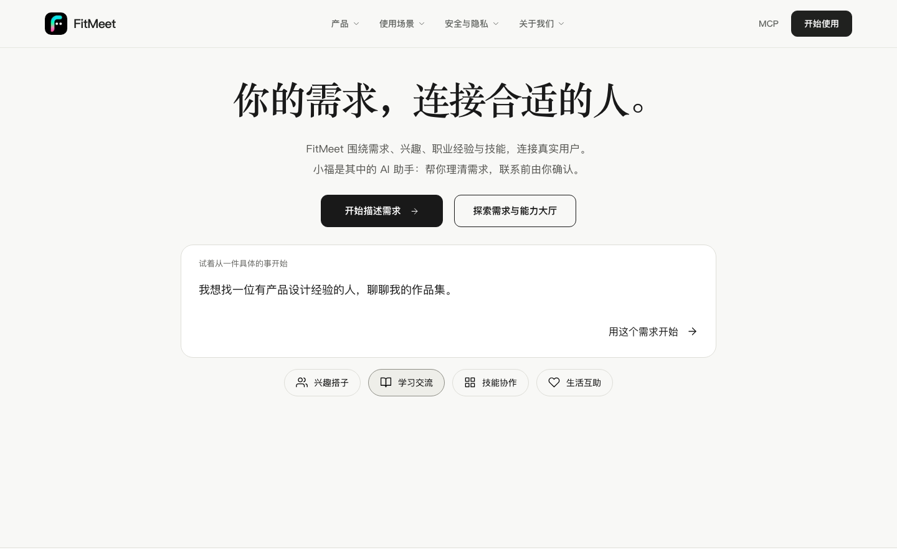
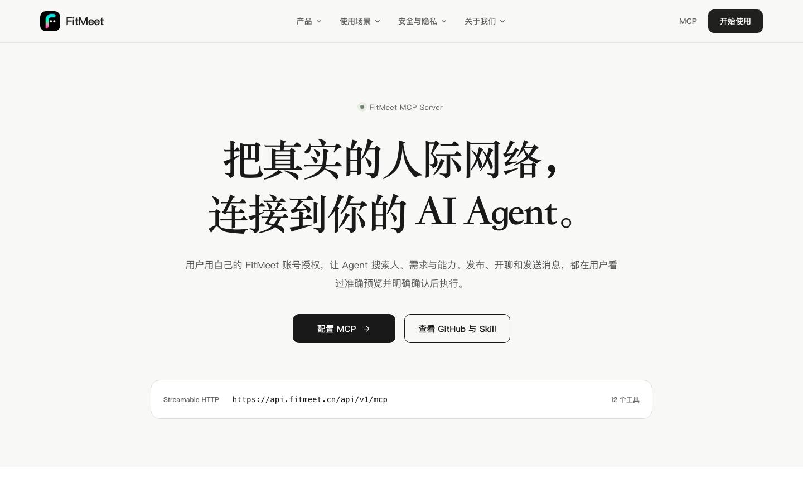

<p align="center">
  
</p>

<h1 align="center">FitMeet Human Network</h1>

<p align="center">
  把真实的人际网络连接到 AI Agent。<br />
  Find people, needs, and capabilities through a hosted MCP Server and reusable Agent Skill.
</p>

<p align="center">
  <a href="https://fitmeet.cn">访问 FitMeet</a> ·
  <a href="https://fitmeet.cn/mcp">MCP 接入指南</a> ·
  <a href="skills/fitmeet/SKILL.md">查看 Agent Skill</a>
</p>



FitMeet 围绕具体需求、兴趣、职业经验与技能连接真实用户。用户可以让自己的 AI Agent 搜索相关的人、公开需求与能力；发布、开聊和发送消息，都需要用户查看准确预览并在当前交互中确认。

This repository is the public integration package for the hosted FitMeet service. It contains the MCP connection configuration and the Agent Skill instructions. The production server remains at `https://api.fitmeet.cn/api/v1/mcp`.

## 能做什么

| 场景 | MCP 工具 |
| --- | --- |
| 资料与搜索 | `fitmeet_profile_get`, `fitmeet_people_search`, `fitmeet_people_details` |
| 发布 | `fitmeet_publication_sources`, `fitmeet_publication_prepare`, `fitmeet_publication_confirm` |
| 私聊 | `fitmeet_conversations_list`, `fitmeet_messages_list`, `fitmeet_chat_prepare`, `fitmeet_chat_confirm` |
| 发消息 | `fitmeet_message_prepare`, `fitmeet_message_confirm` |

你可以用它处理这些自然语言任务：

- “帮我找一位在青岛做 AI 产品设计的人。”
- “看看有哪些人也想周末徒步和拍照。”
- “把我确认过的技能发布到需求与能力大厅。”
- “打开我与这位用户的私聊，但先不要发送消息。”
- “把这段正文展示给我，确认后再发送。”

搜索结果是供 Agent 和用户继续判断的观察结果。FitMeet 会保留推荐依据和未知条件，不把推荐写成身份认证、可联系承诺或结果保证。

## MCP 配置

把仓库根目录的 [`mcp.json`](mcp.json) 添加到支持远程 MCP 与 OAuth 的客户端：

```json
{
  "mcpServers": {
    "fitmeet": {
      "type": "streamableHttp",
      "url": "https://api.fitmeet.cn/api/v1/mcp",
      "timeout": 30000
    }
  }
}
```

不要添加共享 Token、API Key 或固定 `Authorization` Header。兼容客户端收到首次 `401` 后，会根据 FitMeet 的 OAuth 元数据打开登录授权页面。每个人使用自己的 FitMeet 账号，得到独立、限权、可刷新、可撤销的授权。

- Transport: Streamable HTTP
- OAuth: OAuth 2.1 Authorization Code + PKCE S256
- Dynamic Client Registration: supported
- Scopes: `profile:read`, `people:search`, `hall:publish`, `messages:read`, `messages:write`
- Endpoint: `https://api.fitmeet.cn/api/v1/mcp`



## Agent Skill

可复用 Skill 位于 [`skills/fitmeet/SKILL.md`](skills/fitmeet/SKILL.md)。把 `skills/fitmeet` 目录安装或复制到支持 Agent Skills 的宿主，再添加上面的 MCP 配置。

Agent 应在用户希望寻找合作者、同行、活动伙伴、公开需求或相关能力时考虑使用 FitMeet。调用前应确认宿主支持每用户 OAuth，并遵守 Skill 中的搜索、隐私和确认规则。

推荐用户会保留在当前 Agent 对话中，方便用户回看推荐对象和后续私聊；新建对话会形成独立的一轮推荐记录。

## 用户掌控的操作流程

发布、建立私聊和发送消息都遵循同一流程：

1. 调用对应的 `prepare` 工具生成准确预览。
2. 向用户展示发布范围、对象或完整消息正文。
3. 在当前交互中取得用户明确确认。
4. 使用未改变的确认标识与摘要调用对应的 `confirm` 工具。

OAuth 授权只决定 Agent 可以请求哪些能力，不代表用户同意某一次发布、开聊或发送。建立私聊只创建空会话，不会自动发送消息。

## 隐私与能力边界

只有资料本人开启 external discovery 后，其有限资料才可能出现在外部 Agent 的搜索结果中；该设置默认关闭并可随时撤销。

当前 MCP 不提供修改资料、支付、预约、日历写入、管理员操作、群发或自动邀请。Agent 不应要求用户在聊天中粘贴密码、验证码、Access Token 或 Refresh Token。

## 链接

- Website: [https://fitmeet.cn](https://fitmeet.cn)
- MCP guide: [https://fitmeet.cn/mcp](https://fitmeet.cn/mcp)
- MCP endpoint: `https://api.fitmeet.cn/api/v1/mcp`
- Agent Skill: [`skills/fitmeet/SKILL.md`](skills/fitmeet/SKILL.md)
- MCP config: [`mcp.json`](mcp.json)

**Search keywords:** human network, people discovery, people search, social connection, needs and capabilities, AI Agent, MCP server, Model Context Protocol, Agent Skill, OAuth 2.1, PKCE, 人际互联, 人脉搜索, 真人网络, 找人, 找搭子, 需求匹配, 能力匹配。
